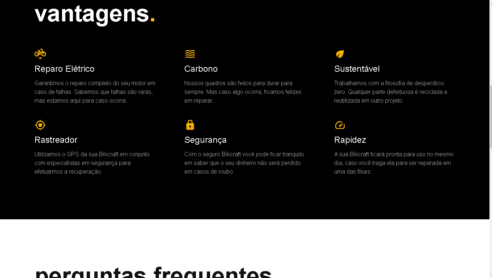
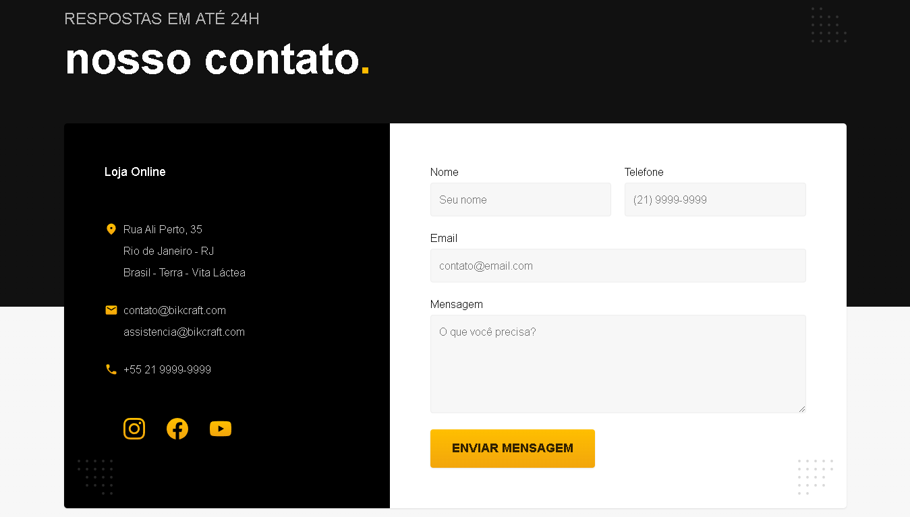
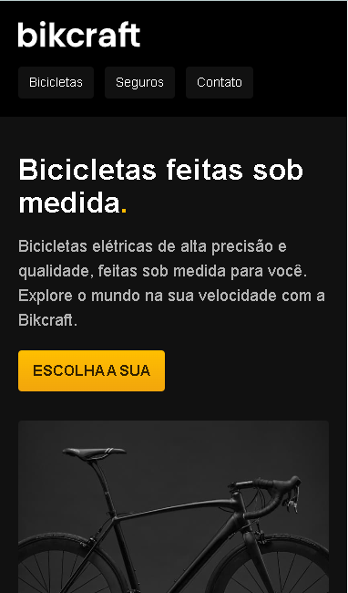

# Bicraft

<h4>Este é um projeto de um site de venda de bicicletas.O projeto contém diversas funcionalidades como:Formulários, animações css entre outros.</h4>

<h1></h1>
<h1></h1>
<h1></h1>
<h1 align="center"></h1>

<h2>Confira este projeto acessando o link abaixo:</h2>
<a target="_blank" href="https://leandrorosadev.github.io/bicraft.io/">Acesse esse Projeto</a>

<h2> Ou rode este projeto localmente em sua workstation:</h2>
<h3>Pré-requisitos</h3>
<h4>Antes de começar você precisa ter instalado em sua máquina as seguintes ferramentas: 
<a target="_blank" href="https://git-scm.com/downloads">Git</a>,
<a target="_blank" href="https://classic.yarnpkg.com/lang/en/docs/install/#windows-stable">Yarn</a>
e um editor de Texto como o <a target="_blank" href="https://code.visualstudio.com/download">VSCode</a> para trabalhar com o código</h4>

```bash
# Clone este repositório
$git clone <https://github.com/LeandroRosaDev/bicraft.io>

#Acesse a pasta do projeto no terminal/CMD
$cd portifolio

#instale as dependencias
$yarn

#Execute a aplicação em modo de desenvolvimento
$yarn start

#O servidor iniciará na porta 3000 - acesse <http://localhost:3000

``` 

### Tecnologias: 
Html ;

Css;

JavaScript;


### Features Realizadas recentemente
- [x] Responsividade
- [x] Mudança de paleta de cores
- [x] Formulários
- [x] Mapas

### Features Futuras
- [x] Adicionar acordion List na parte de perguntas frequentes
- [x] Adicionar menu responsivo
- [x]  Adicionar seleção de modo escuro/claro
- [x]  Adicionar seleção de idiomas
- [x]  Refatorar totalmente o código para REACT


<h2>Autor</h2>
<h3>Leandro Rosa 👨🏻‍💻</3>
<h4>Confira meu Linkedin no link a seguir: <a target="_blank" href="https://www.linkedin.com/in/leandro-rosa-28ba8722a/">Leandro Rosa</a></h4>
